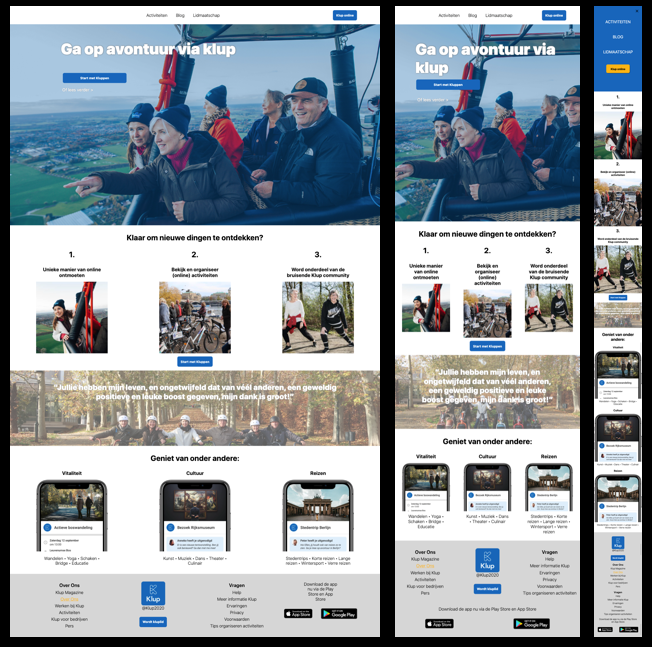
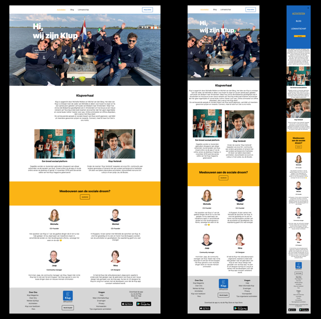
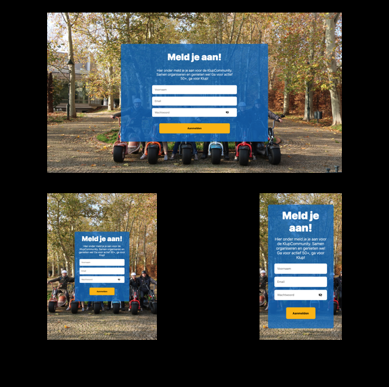
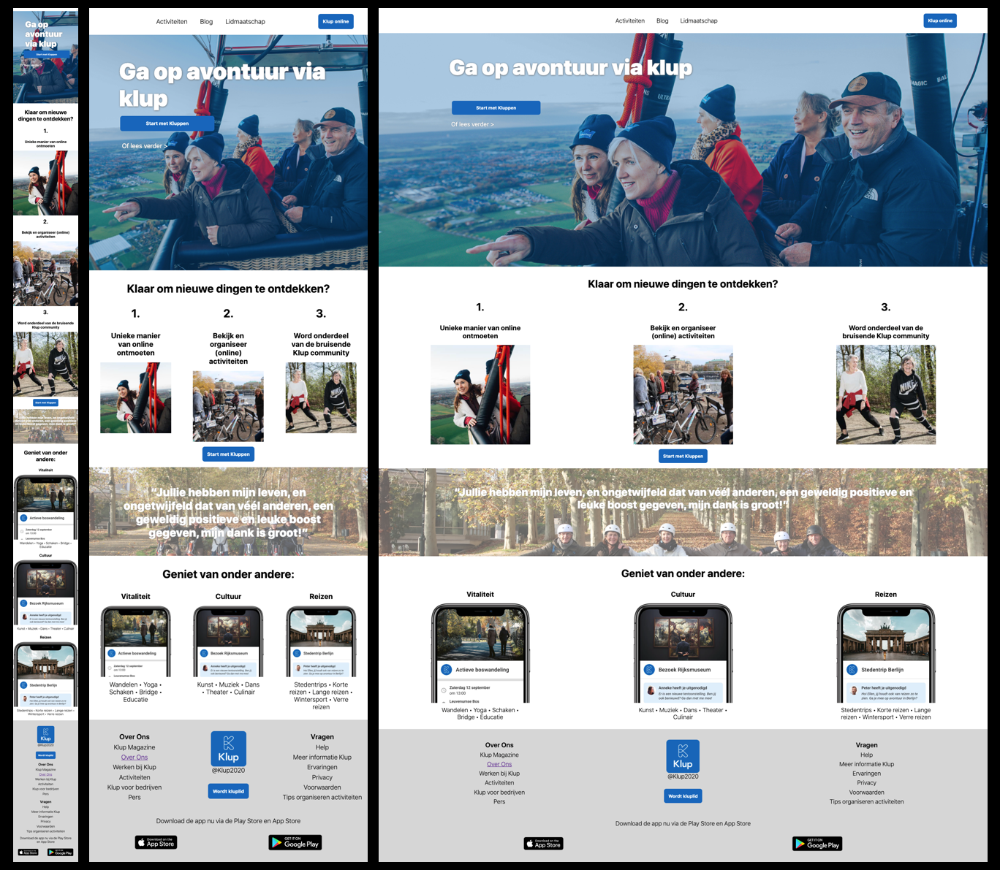
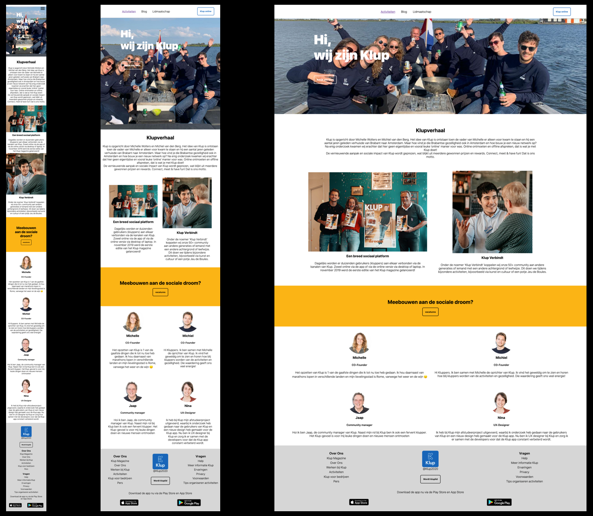

# Procesverslag
**Auteur:** -Renske Steenbrink-

Markdown cheat cheet: [Hulp bij het schrijven van Markdown](https://github.com/adam-p/markdown-here/wiki/Markdown-Cheatsheet). Nb. de standaardstructuur en de spartaanse opmaak zijn helemaal prima. Het gaat om de inhoud van je procesverslag. Besteedt de tijd voor pracht en praal aan je website.

## Bronnenlijst
1. Positionering: https://dlo.mijnhva.nl/content/enforced/192602-FDMCI-2000FED116-DMCI-CMD-2021/FED%2020-21%20-%20Blok%201%20-%20Oefening%20positioneren.pdf
2. JS 3-stap: https://dlo.mijnhva.nl/content/enforced/192602-FDMCI-2000FED116-DMCI-CMD-2021/FED%2020-21%20-%20Blok%201%20-%20Oefening%20JS%203-stap.pdf
3. Grid: https://dlo.mijnhva.nl/content/enforced/192602-FDMCI-2000FED116-DMCI-CMD-2021/FED%2020-21%20-%20Blok%201%20-%20Oefening%20grid.pdf
4. Animaties: https://dlo.mijnhva.nl/content/enforced/192602-FDMCI-2000FED116-DMCI-CMD-2021/FED%2020-21%20-%20Blok%201%20-%20Oefening%20animaties.pdf
5. Toegankelijkheid: https://dlo.mijnhva.nl/content/enforced/
192602-FDMCI-2000FED116-DMCI-CMD-2021/FED%2020-21%20-%20Blok%201%20-%20Oefening%20toegankelijkheid.pdf
6. MediaQueries: https://dlo.mijnhva.nl/content/enforced/192602-FDMCI-2000FED116-DMCI-CMD-2021/FED%2020-21%20-%20Blok%201%20-%20Oefening%20media%20queries.pdf
7. This guy, Jelmer Overeem.

+ Alle bijbehorende oefeningen van codepen

## Bronnen van buiten school
1. Coyier, C. (2020, 28 september). A Complete Guide to Flexbox. CSS-Tricks. https://css-tricks.com/snippets/css/a-guide-to-flexbox/
2. James, O. (2017). Flexbox | HTML & CSS Is Hard. Flexbox Tutorial. https://www.internetingishard.com/html-and-css/flexbox/#flex-container-order
3. W3Schools Online Web Tutorials. (1999–2020). W3Schools online webdevelopment. https://www.w3schools.com/

## Onderbouwing van werk a.d.h.v. het beoordelingsformulier

### Beoordeling 
    -Ervan uitgaande dat de voorwaarden voldaan zijn-

### Responsive & Surface
Oorspronkelijk was het idee mij te focussen op service, maar gezien ik er zo veel tijd in heb gestoken liep ik een beetje voor. Hierdoor ben ik ook meer tijd gaan steken in de surfacelaag. Zo heb ik meerdere animaties uitgewerkt. ben ik bezig geweest met toegankelijkheid. Heb ik geprobeerd van alle lessen wel een beetje code toe te voegen en heb ik zelf een formulier aan de pagina toegevoegd voor extra materiaal. Hieronder meer daarover:

### Formulier
Deze zat oorspronkelijk niet in mijn website, ik heb deze zelf toegepast om toegankelijkheid te testen en te zorgen dat mensen zich kunnen aanmelden. Want wat heb je precies aan een informatiewebsite als je niet door gan naar het aanmelden. Ik heb hiervoor een compleet nieuwe aanmeldpagina gemaakt (afgeleid van de originele). en heb de focus gelegd op de toegankelijkheid hiervan.
Ik ben hier naast de normale style hobbels nergens tegenaan gelopen. dit ging eigenlijk best goed en hij is erg toegankelijk, naar mijn idee.

### Complexiteit
De gekozen website is eigenlijk heel erg saai. Alle complexere elementen en animaties heb ik dus zelf moeten bedenken en toepassen. Hieronder welke elementen hier onder vallen.
- Typografie in de footer
    Hier wist ik al dat het lastig zou worden. de eerste li's van elke ul moesten groter en dikker gedrukt. Hier had ik het een en het ander aan moeite met pseudoselectoren en dat het niet wilde lukken. maar uiteindelijk is het gelukt en geeft het een duidelijke hierarchie af. zeker van toegevoegde waarde.
- Responsiveness in de eerste section
    Deze section was een drama. Het is natuurlijk het eerste waarop je binnenkomt, dus het moest echt goed en mooi werken. Hier ben ik heel druk bezig gegaan met mediaqueries om te zorgen dat dit zo soepel mogelijk verliep.
- toegankelijkheid op de Elementen
    Zoals eerder benoemd heb ik in het Form veel aandacht besteeds aan de toegankelijkheid. Alle elementen op de homepagina staan in een logische volgorde en ook de linkjes zijn toegankelijk gemaakt.
- toegankelijkheid in contrast en grootte
    Een van de dingen wat goed zit op deze site is het contrast. Aangezien klup met ouderen werkt kijk je bij elke knop, overlay en tekstje of het goedgekeurd wordt door de contrast checker en ga je niet kleiner werken dan een font van 18px.
### Animaties 
- Animaties in de knoppen
    Omdat niet alle knoppen een nut hebben in mijn uitwerking (aangezien we maar 2 pagina's doen) en ik de toegankelijkheid al op andere elementen had zitten. wilde ik hier losgaan met animaties. Zo veranderen de knoppen van kleur en groote als je er overheen gaat om je te misleiden dat je er op kunt klikken.
- 

# GESPREKKEN & VOORTGANGEN #

## Eindgesprek (week 7/8)

-dit ging goed & dit was lastig-

**Screenshot(s):**

-screenshot(s) van je eindresultaat-

## Voortgang 3 (week 6)

### Stand van zaken
Ja gaat goed, naar mijn idee is dit eigenlijk al af en naast de dingen die ik nu heb opgeschreven zijn er ook geen problemen meer. Kom maar op met dat cijfer.

**Screenshot(s):**

### Agenda voor meeting
- hoe ga ik op de semantische manier uit mijn form terug naar de homepagina.
- Wat zou ik nog kunnen toevoegen om het beter te maken? 
- jij had het over met je spatiebalk door de site heengaan. Hoe doe jij dat? mij lukt het niet... ik kan niet eens in mijn scherm komen. hij blijft andere dingen oplezen.

### Verslag van meeting

## Voortgang 2 (week 5)

### Stand van zaken
Ja gaat heel goed eigenlijk, mijn pagina ziet er stukje bij beetje mooier uit en ook het responsive gaat steeds soepeler. Javascript laat ik even voorwat het is. maar ik ben trots op hoe het er nu uitziet en hoe dingen me lukken.

**Screenshot(s):**

### Agenda voor meeting
- Bij mijn footer krijg ik mijn grid niet naar 4 colommen bij @media min 1080 en ik snap niet waarom?
    - *1 dag na dit opschrijven* nu werkt niets meer op mobiel van mijn footer
- MOET je javascript hebben in de site? ik ga zo lekker met css en animaties enzo.
- paar comments in mijn code gezet waar dingen mis gaan en waar ik zelf niet uitkom.
- image mapjes zitten in mapjes in github, hoe haal je dat weg?

### Verslag van meeting

Samen een oplossing gevonden voor mijn footer probleem. Hij werkt nu gelukkig weer. door de verschillende comments heen gelopen en gekeken waar de problemen zatten, dit is er fijn voor je probleemoplossend denken. Heel even gepraat over github en daar dingen voor opgezocht, maar tot de conclusie gekomen dat het aanmaken van een nieuwe repository nog sneller is.

En even samen het beoordelingsformulier doorgenomen.

## Voortgang 1 (week 3)

### Stand van zaken

-Wat goed ging was hulp vragen, toegeven dat ik in paniek raakte en mijn googleskills me niet meer hielpen en hulp vragen. Daarnaast ben ik heel trots op wat ik neer heb gezet ondanks andere denken 'wat is dit' net als ik denk over lelijke designs uit paint. Maar kan me niets schelen, ik vind dat het supergoed is-

**Screenshot(s):**

### Agenda voor meeting

Aangezien ik niet heel erg veel input kreeg van mijn groepje en ook nog nooit van ze gehoord heb, is dit mijn Agenda:

- Kijken waarom mijn pagina breeder is dan hij zou moeten zijn.
- Afbeeldingen stylen
    Hoogtes, in artikelen, text op de afbeelding?
- buttons op de goede plek zetten
- hoe zorg ik dat mijn articles een bepaalde grote houden en naast elkaar gaan staan?
- waarom sommige wel naast elkaar willen en andere niet |(van ons pagina)

### Verslag van meeting

* Kijken waarom mijn pagina breeder is dan hij zou moeten zijn.
    * Padding van mn elementen
* Afbeeldingen stylen Hoogtes, in artikelen, text op de afbeelding?
    * % of em gebruiken
    * Grote afbeeldingen in css ipv html
* buttons op de goede plek zetten
    * Display: block; aanzetten anders zijn ze inline
* hoe zorg ik dat mijn articles een bepaalde grote houden en naast elkaar gaan staan?
    * Dit is een heel magie met dingen die ik gewoon verkeerd heb gedaan+ mediaqueries gebruiken
* waarom sommige wel naast elkaar willen en andere niet |(van ons pagina)
    * Weer dingen die ik fout heb gedaan.

TOEVOEGING
- Probeer zoveel mogelijk van de classes weg te halenn

## Intake (week 1)

**Je startniveau:** -Blauw-

**Je focus:** -Responsive-

**Je opdracht:** -www.kluppen.nl-

**Screenshot(s):**

**Breakdown-schets(en):**

